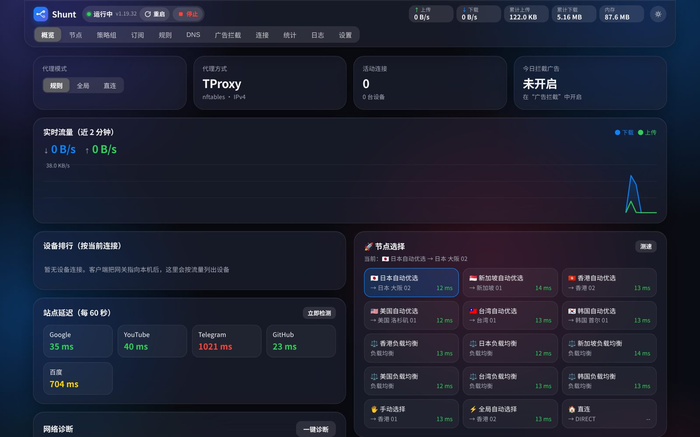
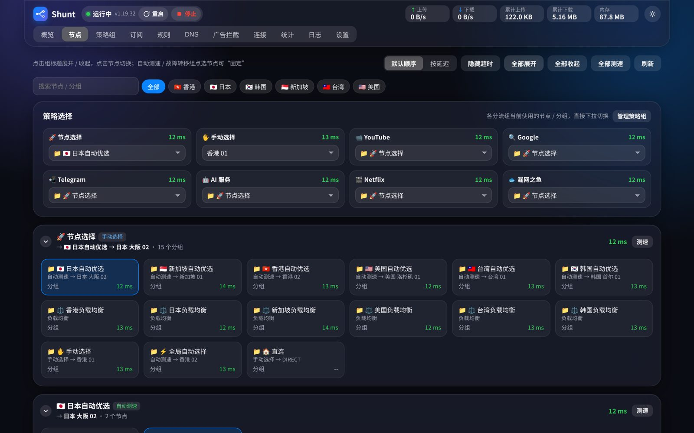
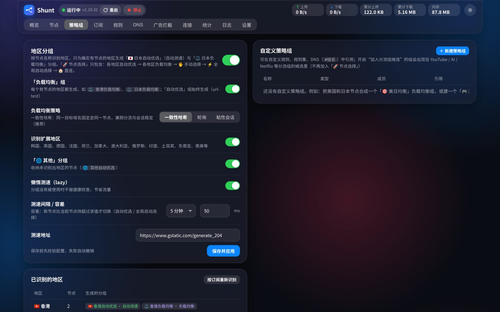
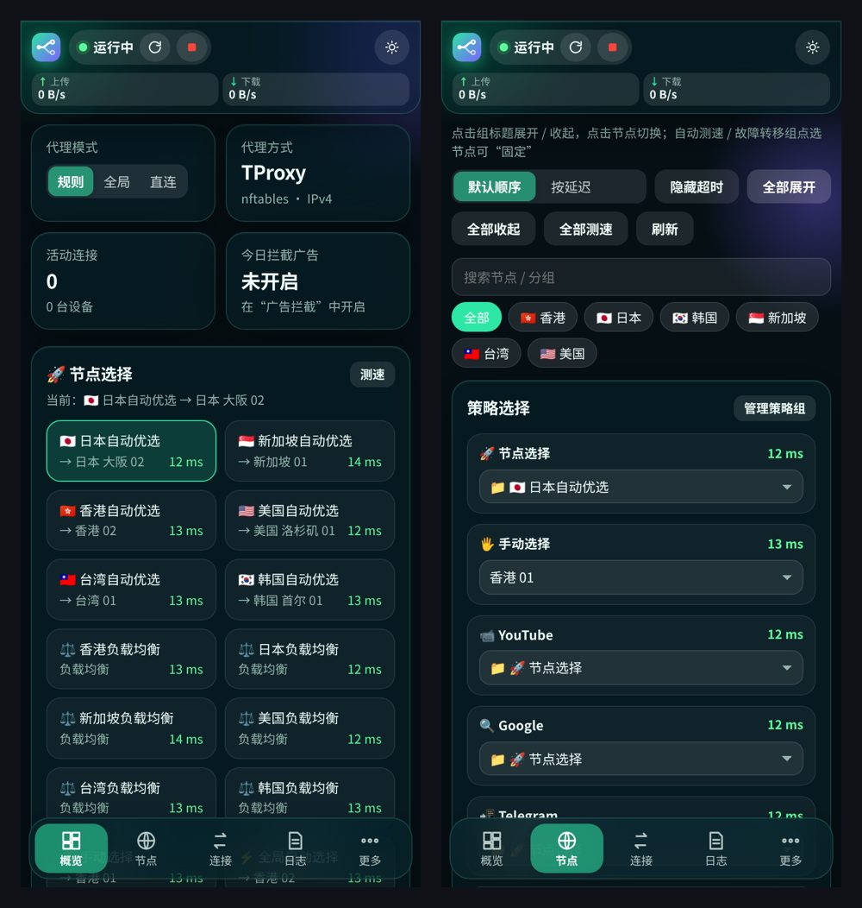

<p align="center"></p>

<h1 align="center">Shunt 分流</h1>

<p align="center">Alpine 旁路由一键透明代理 + Web 管理面板，支持 mihomo / sing-box 双内核</p>



## 能做什么

- **一键装好**：一条命令装完核心、面板和开机自启
- **透明代理**：局域网设备把网关和 DNS 指向旁路由就能用，支持 TProxy / TUN、IPv6
- **订阅和节点**：粘贴订阅链接或节点链接即可，按地区自动分组、自动测速选最快
- **分流**：国内直连，国外走代理；YouTube、Google、Telegram、AI、Netflix 可单独选节点
- **双内核**：mihomo 和 sing-box 一键切换，设置共用
- **好用的面板**：实时流量、连接、日志、统计、广告拦截、DNS 防泄露、网络诊断
- **省心**：核心挂了自动重启，修不好就自动切直连，保证家里能上网
- **10 套主题 + 自定义背景图**，手机上也好用

## 安装

在 Alpine Linux 上用 root 执行：

```sh
# 国内网络
wget -qO- https://ghfast.top/https://raw.githubusercontent.com/Skycnhe/mihomo-panel/Hk001/install.sh | sh -s -- --cn

# 国外网络
wget -qO- https://raw.githubusercontent.com/Skycnhe/mihomo-panel/Hk001/install.sh | sh
```

装完会显示面板地址（默认 `http://旁路由IP:8080`）和随机生成的初始密码，登录后可在「设置」里修改。

## 使用

1. 打开面板 →「订阅」粘贴你的订阅链接
2. 把要上网的设备（或主路由的 DHCP）的 **网关** 和 **DNS** 都改成旁路由的 IP
3. 回到「概览」看各站点延迟变绿就好了

## 截图

**节点**：按地区分组，点一下就能切换



**策略组**：地区分组、负载均衡、自定义分组



**外观**：10 套主题，可换背景图（图中为「赛博朋克」）


**手机**

<p align="center"></p>

## 常用命令

```sh
rc-service mihomo restart          # 重启核心
rc-service mihomo-panel restart    # 重启面板
/opt/mihomo-panel/tproxy.sh stop   # 临时关闭透明代理（apply 恢复）
```

面板和内核都能在「设置」里在线更新，出问题可一键回滚。

## 端口

8080 面板 · 7890 HTTP/SOCKS 代理 · 7893 TProxy · 1053 DNS · 9090 控制器（仅本机）

---

更新记录和详细说明见 [CHANGELOG.md](CHANGELOG.md)。
